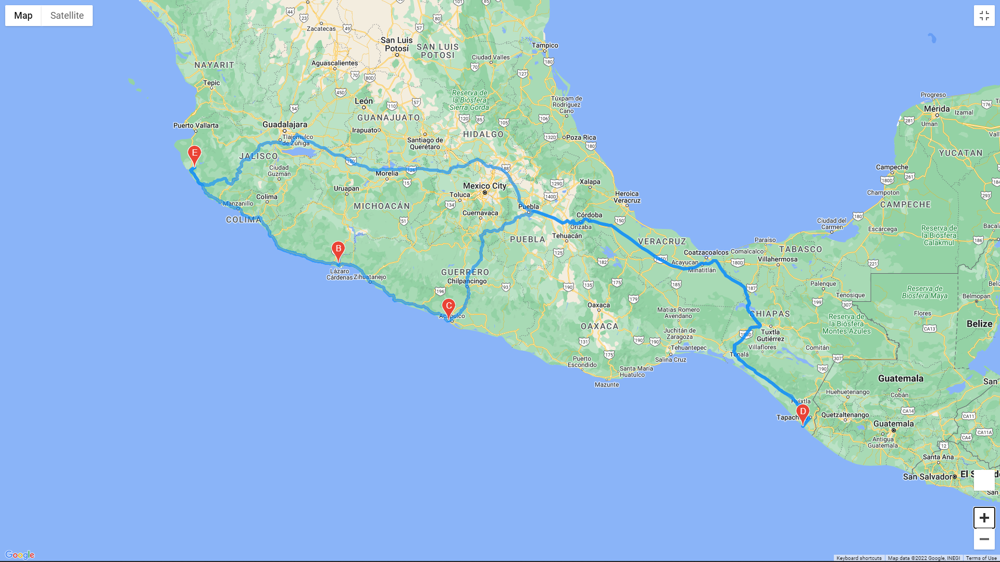

# PlanMyTrip App Next Level Improvements

## ***Overview of the school district analysis***

### **Purpose**
<!--Explain the purpose of the new analysis..-->

Deliver the app with additions of the weather description to the already retrieved weather data. As well to include an input statements to filter the data for tester's weather preferences, which will be used to identify potential travel destinations and nearby hotels. In order that the beta testers will choose a few cities to create a travel itinerary from the list of potential travel destinations.

 

## ***Results***
<!--Using the extracted images, give some insights of the results..-->

### **Vacation Search**

<table>
    <tr>
        <td>WeatherPy Vacation Map</td>
    </tr>
    <tr>
        <td></td>
    </tr>
</table>

    The purpose of this result is to find possible vacation locations from a database of almost 700 cities around the world, but with the beta tester's preferences of range temprature. In other words, to find the final city options between the chosen range of 'Max Temperature' and 'Min Temperature'.
    The idea is to give a clean data of how many cities are in a specific radius for their vacation search.

### **Vacation Itinerary**

<table>
    <tr>
        <td>WeatherPy Travel Map Markers</td>
    </tr>
    <tr>
        <td></td>
    </tr>
</table>

    Once the beta testers choose their destinations, the app will provide the chosen ones taking in mind the preferences of temperature. In this case four cities were selected and the markers are showing the: Hotel Name, City, Country, Current Description (wether), and, the Max Temperature.

<table>
    <tr>
        <td>WeatherPy Travel Map Route</td>
    </tr>
    <tr>
        <td></td>
    </tr>
</table>

    The final improvement is meant to show the route of the picked-up cities at the preferences previous step. In this case, the example show a "drviing" route with an intial city that will also be the end of the route.

 

## ***Summary***
<!--There is a statement summarizing the project..-->

As with any new product, a few changes were made to take the app to the next level, not without taking into consideration a the given recommendations. With the using the Google Maps Directions API we are adding the weather description, a filter where to add the weather preferences, a list with potential travel destinations and nearby hotels, and finally, with the chosen cities a travel itinerary and a travel route.